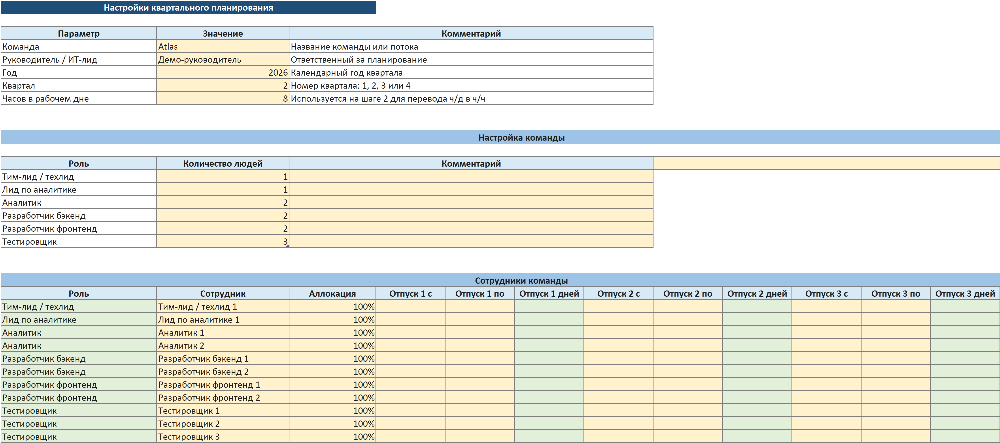
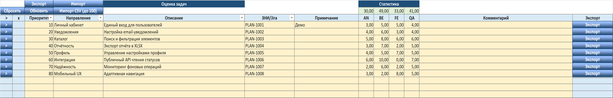
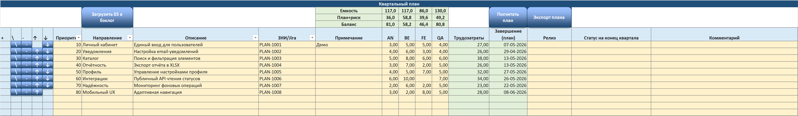

# QuarterPlan Excel

[](https://github.com/NikitaGoguev/excel-planning/actions/workflows/portable-build.yml)
[](https://github.com/NikitaGoguev/excel-planning/releases/latest)
[](LICENSE)

> Excel-based quarterly capacity and delivery planning for IT teams. QuarterPlan Excel combines employee-level availability, vacations, allocations, stage overlap and VBA automation in a reproducible workbook-as-code project.

**QuarterPlan Excel** помогает ИТ-лиду собрать квартальный план из оценок AN/BE/FE/QA, учесть состав команды и отпуска, проверить баланс ресурсов и получить календарные даты этапов.

## Скачать

Готовые пользовательские файлы публикуются в [последнем GitHub Release](https://github.com/NikitaGoguev/excel-planning/releases/latest):

- `QuarterPlan-Excel-v1.0.0.xlsm` — полный вариант с автоматизацией;
- `QuarterPlan-Excel-v1.0.0-no-macros.xlsx` — прозрачный вариант без VBA;
- `SHA256SUMS.txt` — контрольные суммы релизных файлов.

Макросы v1.0.0 не подписаны цифровым сертификатом. Скачивайте XLSM только со страницы Releases, сверяйте SHA-256 и включайте макросы только после проверки источника. Подробности — в [руководстве пользователя](docs/user-guide.md) и [политике безопасности](SECURITY.md).

## Как выглядит работа

### 1. Настройте команду



### 2. Введите или импортируйте оценки



### 3. Соберите и рассчитайте план



Основной сценарий:

1. Укажите команду, квартал, аллокации и отпуска.
2. Добавьте задачи вручную либо импортируйте CSV/XLSX.
3. При необходимости декомпозируйте задачи до двух уровней.
4. Загрузите корневые задачи в бэклог и переместите выбранные задачи в активный план.
5. Запустите расчёт и экспортируйте итоговый квартальный план.

## Возможности

- расчёт capacity по AN, BE, FE и QA;
- аллокации и до трёх периодов отпуска на сотрудника;
- настраиваемые overlap-правила AN → BE → FE → QA;
- ресурсный баланс активного плана с настраиваемым риском;
- статусы готовности, управляющие потреблением этапов;
- импорт CSV/XLSX, декомпозиция и express-estimate export;
- воспроизводимая XLSX/XLSM-сборка и machine-readable contracts.

## Совместимость и ограничения

| Среда | Статус |
| --- | --- |
| Windows desktop Excel 2016 / Microsoft 365 | Проверяется автоматизированным Excel COM acceptance |
| macOS desktop Excel | Best-effort: VBA использует Mac-safe пути, автоматизированного Mac acceptance пока нет |
| Excel Online | Формулы доступны, VBA-автоматизация не поддерживается |
| LibreOffice / другие редакторы | Не являются поддерживаемой runtime-средой |

- В шаблоне предусмотрено 20 сотрудников, 100 оценочных строк, 20 строк активного плана и 20 строк серой зоны.
- Один этап задачи использует не более одного подходящего сотрудника в рабочий день; оставшуюся работу может продолжить другой сотрудник той же экспертизы.
- Manual overrides на листе Capacity влияют на баланс ресурсов, а календарный scheduler использует фактический список сотрудников, аллокации и отпуска.
- XLSX не содержит макросов и поэтому не выполняет кнопочные операции XLSM.

## Разработка

Требуется Node.js 24.x:

```text
npm ci
npm run verify
```

Основные команды:

```text
npm run build             # обезличенная demo-сборка
npm run build:release     # чистые файлы в dist/
npm run verify:static     # contracts без Excel
npm run verify:release    # clean-profile и public-data gate
npm run verify:release:excel # Windows smoke для чистых release-файлов
npm run verify:excel      # Windows desktop Excel acceptance
npm run preview:public    # обновить публичные скриншоты
```

Архитектура и build profiles описаны в [docs/architecture.md](docs/architecture.md) и [docs/development.md](docs/development.md). Правила участия — в [CONTRIBUTING.md](CONTRIBUTING.md).

## Лицензия

QuarterPlan Excel распространяется по лицензии [MIT](LICENSE). Сторонние лицензии сохранены рядом с соответствующими vendored-компонентами.
